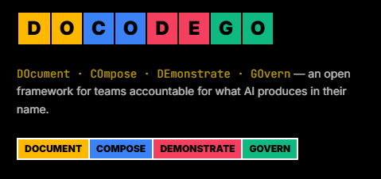

<p align="center">
  <a href="https://docodego.com/">
    
  </a>
</p>

# Branded Survey Builder — What I Implemented

This repo contains a serverless survey builder application (frontend + backend) implemented as the SDE intern take-home assignment. It includes a working builder, per-survey branding, public sharing, anonymous responses, and an owner dashboard to view submissions.

**Implemented highlights**
- [x] Sign-up / basic auth (email + password) and user storage
- [x] Survey builder with add / remove / reorder questions
- [x] At least 3 question types: short text, multiple choice, 1–5 rating
- [x] Per-survey branding: primary color + logo URL (previewed in UI)
- [x] Public survey URL (no login required) that renders in owner's brand
- [x] Anonymous response submission persisted server-side
- [x] Owner dashboard: list surveys and view collected responses

**Tech stack**
- Backend: `Hono` on Cloudflare Workers (see [api/src/index.ts](api/src/index.ts))
- Database: Cloudflare `D1` (SQLite-based) — schema and init in [api/src/db/schema.ts](api/src/db/schema.ts)
- Frontend: `React` + `Vite` + `TanStack Router` (see [web/src](web/src))
- Styling: `Tailwind CSS`
- Language: `TypeScript` (frontend & backend)

Database schema (summary)
- `users` — id, email, name, password_hash, created_at
- `surveys` — id, user_id, title, description, primary_color, logo_url, timestamps
- `questions` — id, survey_id, type, label, options (JSON TEXT), order_index, is_required
- `responses` — id, survey_id, respondent_id (optional), submitted_at
- `answers` — id, response_id, question_id, answer_value

Data flow
1. User signs up → row inserted into `users`.
2. User creates a survey → row inserted into `surveys`.
3. User adds questions → rows inserted into `questions` (options stored as JSON in `options`).
4. Public respondent opens survey URL → fills and submits form.
5. On submit → `responses` row is created and individual `answers` rows are stored for that response.

Run & development
1. Install deps (root):

```powershell
pnpm install
```

2. Start both API + Web (root):

```powershell
pnpm dev
```

Notes:
- API uses `wrangler` and expects a `D1` binding configured via `wrangler.jsonc` (see `d1_databases` entry).
- Database initialization runs on startup via `initializeDb` which executes the SQL in [api/src/db/schema.ts](api/src/db/schema.ts).

Where to look in the repo
- API: [api/src](api/src)
  - `db/schema.ts` — SQL table definitions and `initializeDatabase`
  - `db/queries.ts` — DB helper functions (create/get/update)
  - `routes/` — `auth`, `surveys`, `questions`, `responses`
- Web: [web/src](web/src)
  - `routes/` — app routes and pages
  - `utils/api.ts` — API client used by the frontend

Notes & tradeoffs
- Branding uses a `logo_url` field instead of uploading assets (R2) to keep the MVP focused and simpler to deploy.
- `questions.options` stored as JSON in a TEXT column to avoid extra tables for option rows; this simplifies writes and UI rendering at the cost of SQL-side querying.

Future improvements
- Implement secure sessions (KV or JWT) and password reset flows
- Add logo upload via Cloudflare R2 and serve assets from R2
- Add analytics and CSV export for responses

File: [survey-builder/README.md](survey-builder/README.md)

```bash
pnpm install        # installs api, web, and root devDeps in one pass
pnpm dev            # runs api (:8787) and web (:5173) together, output prefixed [api]/[web]
```

Open http://localhost:5173 — you should see the starter placeholder page pointing back to this README. `/api/health` (proxied through Vite) returns `{ "status": "ok" }`. From there, it's your project.

Other useful scripts (from the root):

```bash
pnpm check          # biome — formatting + linting, must pass on submission
pnpm check:fix      # auto-fix what biome can fix
pnpm typecheck      # tsc --noEmit across both packages
pnpm build          # production build of web
```

When you add Cloudflare bindings (D1, KV, R2, secrets) in `api/wrangler.jsonc`, regenerate `Env` types:

```bash
pnpm --filter sde-intern-task-api cf-typegen
```
